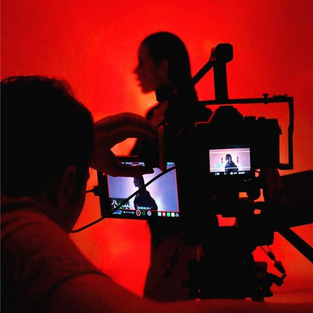

<article>

  

  
  

  

  
Andrei Pacuraru is a meticulous, story driven Cinematographer working in narrative, drama, documentary, advertising and corporate under the umbrella of ShepherdTone- a London based creative cooperative he founded in 2015.

  
Following a lifelong obsession with the moving image kindled during his youth by unadulterated consumption of 90's Romanian cable TV, he studied Film Editing & Sound at the National Film and Theatre University “I.L. Caragiale” where he graduated with honours. During his studies, he developed a keen interest in cinematography and started experimenting with form to find his own take on the medium.

  
Growing up in the cultural tapestry that is the shore of the Black Sea, Andrei was inspired to seek out an eclectic array of artistic movements, being equally fond of the works of Andrei Tarkovsky, Lucian Pintilie and Sergei Parajanov  on one hand and Terry Gilliam, Ridley Scott and Mike Leigh on the other: filmmakers who seem to have little in common yet somehow manage to put on screen our common humanity.

  
   
Complete dedication and attention to detail are the two characteristics that guide Andrei’s approach both to life and to filmmaking. This has led to his work being screened around the world, garnering multiple awards thanks to tightly-knit relationships with his collaborators and a continuous drive to render the extraordinary in the mundane, the engaging moments in day-to-day life.

  
  

</article>
